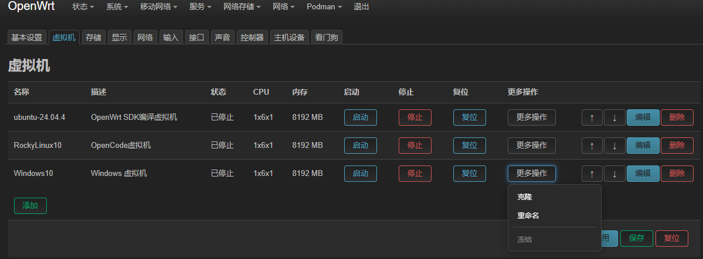

# luci-app-qemu

QEMU Virtual Machine Manager for OpenWrt/LEDE

## Sponsor

If you find this project helpful, you can sponsor me:

<div align="center">

<table>
<tr>
<td></td>
<td></td>
</tr>
<tr>
<td align="center">WeChat</td>
<td align="center">Alipay</td>
</tr>
</table>

</div>

## Overview

luci-app-qemu is a LuCI-based web interface for managing QEMU virtual machines on OpenWrt/LEDE systems. It provides a user-friendly interface to create, configure, start, stop, and monitor virtual machines directly from the web browser.

## Screenshots

### Virtual Machine List


### Add New Virtual Machine


### Basic Settings


### Storage Configuration


### Network Configuration


### PCI Device Passthrough


### Global Settings


## Features

- **Virtual Machine Management**
  - Create new virtual machines with wizard
  - Start, stop, restart virtual machines
  - View VM status and resource usage
  - Force stop unresponsive VMs
  - Auto-start configuration

- **Hardware Configuration**
  - CPU and memory allocation
  - Storage device management (disk images, VirtIO, IDE, SCSI, USB)
  - Network interface configuration
  - Display settings (VNC)
  - Input devices (keyboard, mouse)
  - Sound devices
  - Controller devices (USB, SCSI, VirtIO Serial)
  - Host device passthrough (PCI Passthrough)
  - Watchdog timer

- **Advanced Settings**
  - Boot options (Legacy BIOS/UEFI)
  - VNC display with password protection
  - Serial console access
  - QMP interface for advanced management

- **Storage Management**
  - Create and manage disk images
  - Support for various disk formats (qcow2, raw, etc.)
  - Disk image resizing

- **Network Configuration**
  - User mode NAT network
  - Tap network
  - Bridge network interfaces
  - Socket network
  - Port forwarding

## Requirements

- OpenWrt 25.12.1 or later (x86_64 architecture only)
- QEMU packages:
  - `qemu-system-x86_64`
  - `qemu-img`
  - `qemu-bridge-helper`
  - `qemu-firmware-seabios` (for Legacy BIOS support)
- OVMF package (for UEFI support):
  - Build from [edk2-ovmf](https://github.com/hoyoho/edk2-ovmf) for OpenWrt
- Kernel modules:
  - `kmod-tun`
  - `kmod-kvm-amd` or `kmod-kvm-intel` (for hardware acceleration)
- Additional packages:
  - `socat` (for QMP communication)
  - `luci-compat` (for LuCI compatibility)

## Installation

### From APK Package

1. Download the latest APK package from the [releases](https://github.com/hoyoho/luci-app-qemu/releases) page
2. Upload the APK to your OpenWrt device
3. Install the package:
   ```bash
   apk add --force-overwrite --allow-untrusted luci-app-qemu*.apk luci-i18n-qemu*.apk
   ```
4. Install runtime dependencies:
   ```bash
   apk add qemu-system-x86_64 qemu-img qemu-bridge-helper qemu-firmware-seabios kmod-tun kmod-kvm-amd socat
   ```

### From Source

To build luci-app-qemu from source, add the custom feed to your OpenWrt build environment:

1. Clone the repository to your OpenWrt SDK's packages directory:
   ```bash
   git clone https://github.com/hoyoho/luci-app-qemu.git /path/to/sdk/package/luci-app-qemu
   ```

2. Enter the build configuration menu:
   ```bash
   make menuconfig
   ```

3. In `make menuconfig`, navigate to `LuCI → Applications` to select luci-app-qemu.

4. Exit and save, then compile:
   ```bash
   make package/luci-app-qemu/compile
   ```

## Usage

### Accessing the Interface

1. Open your web browser and navigate to your OpenWrt router's web interface
2. Go to **Services → QEMU Virtual Machines**

### Creating a Virtual Machine

1. Click **Add New Virtual Machine** to start the wizard
2. Follow the steps to configure:
   - Basic settings (name, description)
   - Hardware configuration (CPU, memory)
   - Storage devices (disk images)
   - Network interfaces
   - Display settings (VNC)
   - Advanced options
3. Click **Create** to finish

### Managing Virtual Machines

- **Start**: Click the **Start** button to boot the VM
- **Stop**: Click the **Stop** button to gracefully shut down the VM
- **Force Stop**: Click the **Force Stop** button to immediately terminate the VM
- **Restart**: Click the **Restart** button to reboot the VM
- **Edit**: Click the **Edit** button to modify VM settings
- **Delete**: Click the **Delete** button to remove the VM

### VNC Access

1. Ensure VNC is enabled in the VM's display settings
2. Use a VNC client to connect to `your-router-ip:590X` (where X is the VNC port offset)
3. Enter the password if configured

### Storage Management

1. Go to the **Storage** tab
2. Click **Add Disk Image** to create a new disk
3. Select the disk format and size
4. Click **Create** to generate the disk image

## Configuration

### Global Settings

- **Storage Path**: Default location for disk images
- **Enabled**: Global enable/disable switch for QEMU

### Virtual Machine Settings

Each VM has its own configuration including:
- Name and description
- CPU and memory allocation
- Storage devices
- Network interfaces
- Display settings
- Boot options
- Auto-start configuration

## Enabling ALSA Audio Support

By default, the QEMU package in the OpenWrt feed is compiled without any audio backend (`--audio-drv-list=''`). This means the sound devices configured in luci-app-qemu (AC97, HDA ICH6, HDA ICH9) will silently discard all audio data.

To enable real audio output via ALSA, you need to recompile the QEMU package from the OpenWrt SDK with ALSA support.

### Why Recompilation Is Needed

The upstream QEMU package explicitly disables all audio backends:

```makefile
--audio-drv-list=''        # No audio driver compiled
--disable-alsa             # ALSA disabled
--disable-oss              # OSS disabled
--disable-pa               # PulseAudio disabled
```

This means even if your router has a working sound card with ALSA drivers loaded, QEMU cannot use them.

### Modifying the QEMU Package Makefile

Locate the QEMU package in your OpenWrt SDK:

```
<sdk-root>/package/feeds/packages/qemu/Makefile
```

Apply the following changes:

**1. Add a menuconfig option** — place this near `config QEMU_ZSTD`:

```makefile
config QEMU_AUDIO_ALSA
	bool "QEMU ALSA audio support"
	default n
```

**2. Update configure arguments** — find the `--audio-drv-list` and `--disable-alsa` lines and replace them:

```makefile
--audio-drv-list='$(if $(CONFIG_QEMU_AUDIO_ALSA),alsa,)' \
--$(if $(CONFIG_QEMU_AUDIO_ALSA),enable,disable)-alsa \
```

Leave the other audio-related lines (`--disable-oss`, `--disable-pa`) unchanged.

**3. Add dependency** — in the `qemu-target` package block, add to the `DEPENDS` line:

```makefile
+QEMU_AUDIO_ALSA:alsa-lib \
```

**4. Register the config symbol** — add to `PKG_CONFIG_DEPENDS`:

```makefile
CONFIG_QEMU_AUDIO_ALSA \
```

### Building and Installing

```bash
# 1. Enter the SDK directory
cd <sdk-root>

# 2. Enable the option in menuconfig
make menuconfig
# Navigate to: Utilities → Virtualization → QEMU ALSA audio support → Enable

# 3. Compile the QEMU package
make package/qemu/compile V=s

# 4. Find the built package
ls bin/packages/*/packages/qemu-*_*.ipk

# 5. Copy to your router and install
scp bin/packages/*/packages/qemu-*_*.ipk root@<router-ip>:/tmp/
ssh root@<router-ip>
opkg install /tmp/qemu-*.ipk --force-reinstall
```

After reinstalling the QEMU package, the sound devices configured in luci-app-qemu will output audio through the router's ALSA sound system. Verify with:

```bash
qemu-system-x86_64 -audiodev help
# Should now list "alsa" among available audio drivers
```

## Troubleshooting

### Common Issues

1. **VM fails to start**
   - Check if QEMU packages are installed
   - Verify disk images exist and are accessible
   - Check for port conflicts (especially VNC ports)

2. **VNC connection refused**
   - Ensure VNC is enabled in VM settings
   - Check if the VM is running
   - Verify firewall settings allow VNC traffic

3. **Performance issues**
   - Enable KVM hardware acceleration if available
   - Adjust CPU and memory allocation
   - Use SSD storage for better performance

### Logs

- Check system logs for QEMU-related messages:
  ```bash
  logread | grep qemu
  ```
- Check VM-specific logs in the web interface

## Contributing

Contributions are welcome! Please feel free to submit a Pull Request.

### Development Guidelines

- Follow the existing code style
- Test changes thoroughly
- Provide clear commit messages
- Update documentation as needed

## License

This project is licensed under the MIT License - see the [LICENSE](LICENSE) file for details.